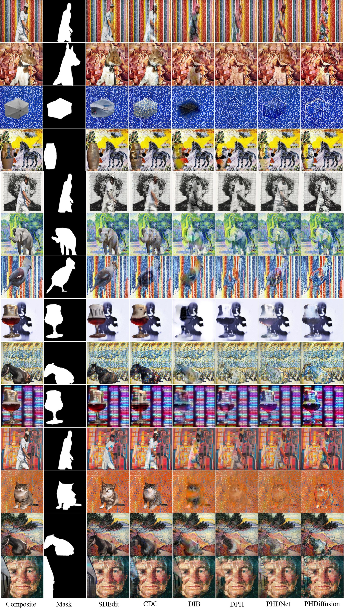
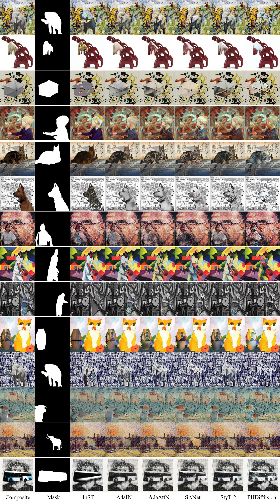

# PHDiffusion-Painterly-Image-Harmonization

This is the official repository for the following paper:

> **Painterly Image Harmonization using Diffusion Model**  [\[arXiv\]](https://arxiv.org/pdf/2308.02228.pdf)<br>
>
> Lingxiao Lu, Jiangtong Li, Junyan Cao, Li Niu, Liqing Zhang<br>
> Accepted by **ACM MM 2023**.

**Our PHDiffusion is the first diffusion-based painterly image harmonization method, which can significantly outperform GAN-based methods when the background has dense textures or abstract style.**

**Our PHDiffusion has been integrated into our image composition toolbox libcom https://github.com/bcmi/libcom. Welcome to visit and try ＼(^▽^)／** 

In simple cases, our GAN-based [PHDNet](https://github.com/bcmi/PHDNet-Painterly-Image-Harmonization/blob/main/README.md) is sufficiently effective and much more efficient. 

Sometimes setting the background style as the target style is not reasonable, this problem has been solved in our [ArtoPIH](https://github.com/bcmi/ArtoPIH-Painterly-Image-Harmonization). 

### Code and model

1.  Dependencies

    *   Python == 3.8
    *   Pytorch == 1.11.0
    *   Run

        ```bash
        pip install -r requirements.txt
        ```
2.  Download Models

    Please download the following models to the `pretrained_models/` folder.

    *   [sd-v1-4](https://huggingface.co/CompVis/stable-diffusion-v-1-4-original/blob/main/sd-v1-4.ckpt). Our model is based on Stable Diffusion v1.4.&#x20;
    *   Our pretrained model. You can download **one** of them for testing. The main difference between the two models is that **PHDiffusionWithoutRes** removes the residual structure in its adapter, while **PHDiffusionWithRes** retains it. Note that **PHDiffusionWithoutRes** perform better in some dense texture styles, learning textures that are more similar to the original ones. While **PHDiffusionWithRes** can preserve better content. You can make selections based on your needs.

        *   [PHDiffusionWithoutRes](https://drive.google.com/file/d/1mP9fUXF58jJGOB28YB0hoi1yK-L5xOj_/view?usp=sharing). The best checkpoint of our adapter **without** residual and dual encoder fusion module.
        *   [PHDiffusionWithRes](https://drive.google.com/file/d/1cJy4N7kzEcjsp5c__--ymmGTjvL2w1Cs/view?usp=sharing). The best checkpoint of our adapter **with** residual and dual encoder fusion module.
    *   [VGG19](https://drive.google.com/file/d/1pZpi45kJi-vnTfQIPrin69MLsUJO0Y_x/view?usp=sharing)(Optional, only needed for training). Loss is calculated with the help of VGG.

3. Training Data
   
   **Data Acquisition**
   
   We have two benchmark datasets: COCO and WikiArt.

   * COCO is a large-scale photograph dataset with instance segmentation annotation for 80 different object categories.
   * WikiArt is a large-scale digital art dataset consisting of 27 distinct styles.

	These datasets are used to create composite images by combining photographic foreground objects from COCO with painterly backgrounds from WikiArt.


	**Data Processing**

	* To obtain properly sized and high-resolution foreground objects, we select 9,100 foreground images from the COCO dataset with a foreground ratio between 0.05 and 0.3, and a width and height of at least 480.
	* We choose 37,931 background images from the WikiArt dataset with a width and height of at least 512.

	During training, we use instance annotation to extract the foreground objects from the foreground images and place them onto randomly chosen painterly backgrounds from the background images, resulting in 37,931 composite images in each epoch.
	Finally, all composite images are resized to 512 × 512 for training. This process can produce composite images with conflicting visual elements.


4.  Train

    You can run this to train adapter and dual encoder fusion module:

    ```bash
    CUDA_VISIBLE_DEVICES="0,1" python -m torch.distributed.launch --nproc_per_node 2 train.py
    ```
5.  Test

    You can run this to test using adapter with residual:

    ```bash
    CUDA_VISIBLE_DEVICES="0" python -m torch.distributed.launch --nproc_per_node=1 test.py --strength 0.7 --model_resume_path pretrained_models/PHDiffusionWithRes.pth
    ```

    And run this to test using adapter without residual:

    ```bash
    CUDA_VISIBLE_DEVICES="0" python -m torch.distributed.launch --nproc_per_node=1 test.py --strength 0.7 --model_resume_path pretrained_models/PHDiffusionWithoutRes.pth --no_residual
    ```

### Experimental results

Our method can significantly outperform GAN-based methods when the background has dense textures or abstract style.

<p align="center">  
  
</p>

<p align="center">  
  
</p>

## Other Resources

*   [Awesome-Image-Harmonization](https://github.com/bcmi/Awesome-Image-Harmonization)
*   [Awesome-Image-Composition](https://github.com/bcmi/Awesome-Image-Composition)

